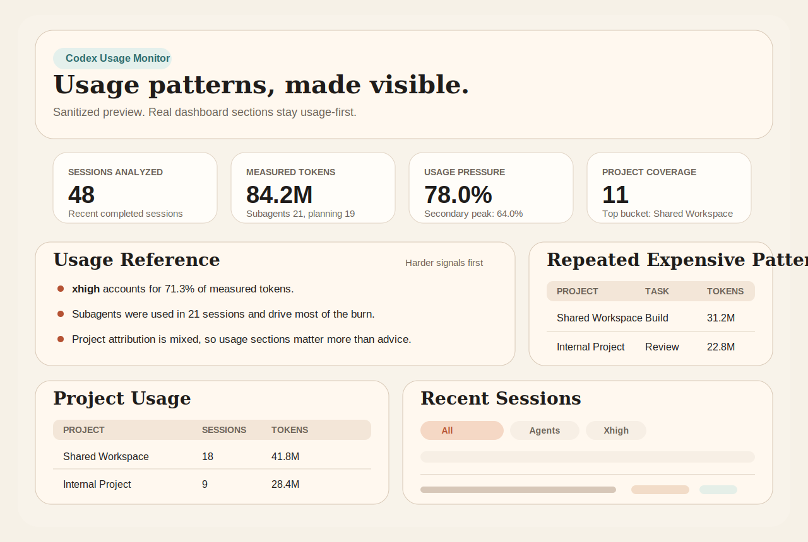

# Codex Usage Monitor

Local dashboard for seeing where your Codex usage is concentrating by project, task type, and setup.

Codex already shows overall usage. This adds a more decision-useful local view of:

- project mix
- repeated expensive patterns
- reasoning / planning / subagent concentration
- daily burn and pressure peaks
- heavier sessions worth inspecting
- measured vs inferred confidence

It reads your local Codex data from `~/.codex` and serves a browser dashboard from your machine. No external API is required.

For example, it can make patterns visible like:

- one project quietly consuming most of your tokens
- `xhigh` and subagents dominating a specific task type
- heavy sessions clustering on a single day

If the native usage board tells you total pressure, this tool is meant to answer where that pressure is actually coming from.



## What It Does

- groups recent sessions by inferred project and task type
- highlights repeated expensive setups
- shows where `xhigh`, planning, and subagents are concentrated
- surfaces heavy sessions and daily burn
- labels what is measured directly versus inferred heuristically

This is primarily a monitor, not an optimizer. It is most useful as a reference layer on top of Codex's native usage view.

## Quick Start

From the repo root:

```bash
python3 scripts/codex_usage_monitor.py serve --days 21 --limit 30
```

Then open:

- `http://127.0.0.1:8765/index.html`

`serve` is localhost-only by default. If you intentionally want LAN access, pass `--host 0.0.0.0`.

Useful commands:

```bash
python3 scripts/codex_usage_monitor.py list --days 21 --limit 20
python3 scripts/codex_usage_monitor.py report --days 21 --limit 30
python3 scripts/codex_usage_monitor.py serve --days 21 --limit 30 --refresh-seconds 60
```

Compatibility:

- Python 3.10+
- macOS-specific launchd example included, but the core script is plain Python

## How It Works

The monitor reads:

- thread metadata from `~/.codex/state_5.sqlite`
- archived and live rollout JSONL files from `~/.codex/archived_sessions` and `~/.codex/sessions`

It also infers project scope from:

- file paths mentioned in tool calls
- `apply_patch` targets
- command arguments and workdirs

The browser page is the main interface. The CLI can also write:

- `tmp/codex_usage/latest-report.md`
- `tmp/codex_usage/latest-report.json`
- `tmp/codex_usage/dashboard.html` from `report`
- `tmp/codex_usage/index.html` from `serve`

If you want project inference to be more meaningful, run the tool from a stable parent directory that contains your projects or pass `--workspace-root /path/to/projects`.

## Read The Dashboard In This Order

1. `Measurement Confidence`
2. `Usage Reference`
3. `Repeated Expensive Patterns`
4. `Project Usage`
5. `Heaviest Sessions`
6. `Burn Summary` and `Daily Burn`

`Advisory Read` should be treated as secondary and lower-confidence than the usage sections above it.

## Always-On Mode

For a login-managed local monitor, this repo includes:

- `scripts/run_codex_usage_monitor.sh`
- `launchd/com.example.codex-usage-monitor.plist`

The launchd template uses port `8769` by default so it stays separate from ad hoc test servers.

The template is intentionally localhost-only.

## Notes

- Python standard library only. No extra dependencies.
- The dashboard uses your real local Codex data, so generated output should be treated as personal workspace data.
- The preview image in this README is sanitized and does not contain real session data.
- The repo does not yet include a license file. Decide that before broad public reuse is encouraged.
